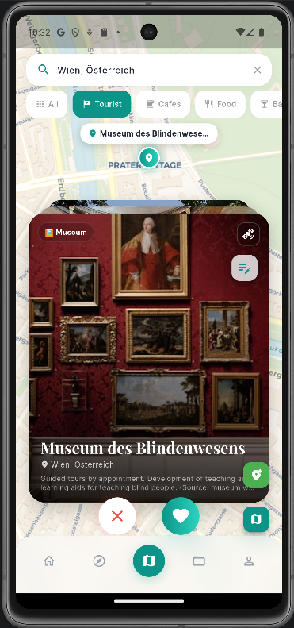
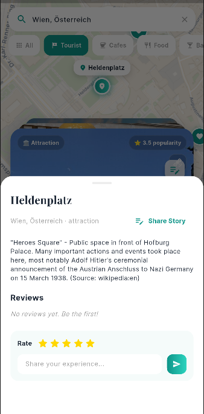
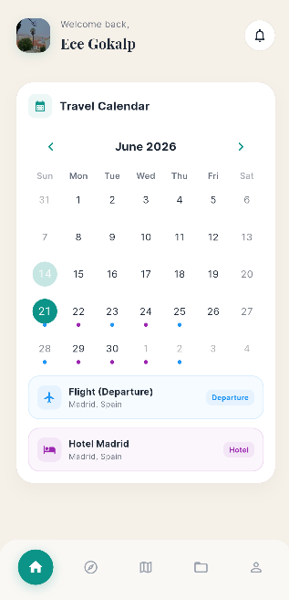
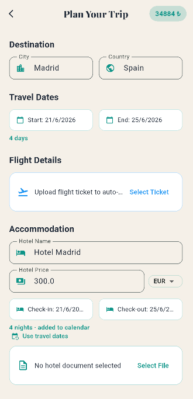
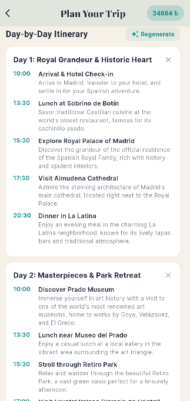
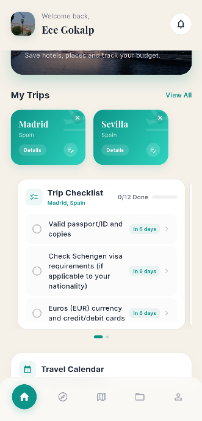
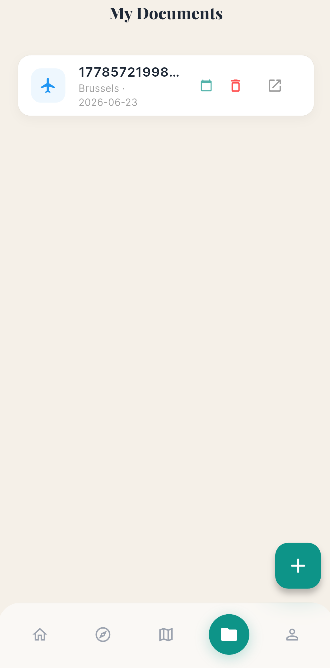
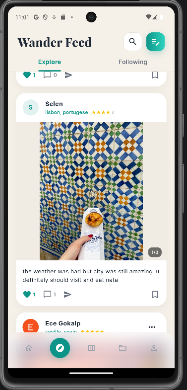
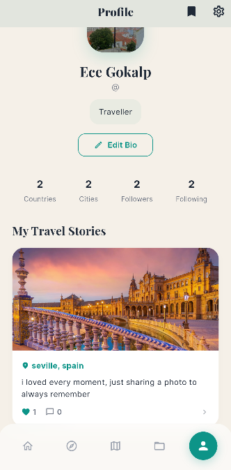

# Wander

A travel planning app built with Flutter that helps you discover places on an interactive map, plan day-by-day trips, keep your travel documents organised, and share your journeys with a community of travellers. AI (Google Gemini) writes your trip checklists and itineraries, drafts blog posts, and reads your tickets to fill your calendar automatically.

## Features

**Map based place discovery.** Search any city in the world and explore real places pulled live from OpenStreetMap (Overpass) — attractions, museums, historic sites, cafes, restaurants, bars, parks and more. Places are enriched with photos and a popularity rating from Wikidata, shown on an interactive map and as a swipeable card deck: swipe right to save a place to your liked list, swipe left to skip. You can also add your own places with a photo and leave star reviews on any place.

**Trip planning.** Create a trip for a destination with start and end dates, hotel details (name, price, check-in / check-out), and a budget split across flights, food, transport, hotel, individual places and a custom limit. All amounts are entered in any of TRY / EUR / USD / GBP and converted to a single total using live exchange rates. Each trip gets an auto-generated checklist and a day-by-day itinerary, and its dates sync to the home calendar.

**AI assistance (Google Gemini).** Gemini powers four distinct features: it generates a country-specific travel checklist (visa, currency, adaptor, health, customs, packing), builds a day-by-day itinerary with timed activities and meals, drafts an engaging blog post for a city with one tap, and reads uploaded tickets and bookings to extract dates, prices and locations into calendar events.

**Travel documents.** Upload flight tickets, hotel confirmations and other documents as PDF, image or straight from the camera. Files are stored in Firebase Storage, and Gemini reads each document to pull out the important dates and add them to your travel calendar automatically. Manual entry is also supported.

**Travel calendar.** A calendar on the home page collects all your trips and documents in one place, with colour-coded markers for flights, hotels, transport and tickets. Local notifications remind you about upcoming events one day before and three hours before.

**Social feed and stories.** Write travel stories with photos, a location and a star rating, then publish them to a community feed. Browse an Explore feed of everyone's stories or a Following feed of people you follow, and like, comment on, save and share any post. Follow other travellers, see their visited countries and cities, and get push notifications when someone likes, comments on, saves or follows you.

**Profiles.** Each profile shows a photo, bio, follower and following counts, visited countries and cities, and a grid of published stories. You can edit your own bio and photo, add places you have visited, and bookmark stories to read later.

**Other.** Email/password and Google sign-in with password reset, light and dark themes, a glassmorphic bottom navigation bar, an in-app Help Center and About page.

## Tech stack

- Flutter (Dart) for the mobile app
- Firebase: Authentication (email/password + Google), Cloud Firestore, Storage
- Google Gemini (`gemini-2.5-flash`) for checklists, itineraries, blog drafts and document extraction
- OpenStreetMap Nominatim (city search) and Overpass (places); Wikidata + Wikimedia Commons (images and popularity)
- Frankfurter API for live currency exchange rates
- `flutter_map` for maps, `flutter_card_swiper` for the swipe deck, `table_calendar` for the calendar
- `flutter_local_notifications` with `timezone` for reminders
- `google_fonts` (Playfair Display + Inter) for typography

## Screenshots

| Map explore + swipe deck | Place detail & reviews | Travel calendar |
| --- | --- | --- |
|  |  |  |

| Trip planner | AI itinerary | AI checklist |
| --- | --- | --- |
|  |  |  |

| Documents (AI extraction) | Discover feed | Profile |
| --- | --- | --- |
|  |  |  |

## Flutter version

This project was built and tested with:

- Flutter **3.41.4** (stable channel)
- Dart **3.11.1**

Newer Flutter 3.x versions should also work. You can check your own version with `flutter --version`.

## Getting started

If you have never run a Flutter project before, follow every step below in order.

### 1. Install the tools

1. **Install Flutter.** Download and install the Flutter SDK from <https://docs.flutter.dev/get-started/install> (Dart comes bundled with it — you do not need to install Dart separately). After installing, open a terminal and run `flutter doctor` to confirm everything is set up.
2. **Install an editor.** Install [Android Studio](https://developer.android.com/studio) (recommended) or [Visual Studio Code](https://code.visualstudio.com/).
3. **Add the Flutter and Dart plugins** to your editor:
   - In Android Studio: open **Plugins** → **Marketplace**, search for **Flutter**, click **Install** (it will also install the Dart plugin), then restart.
   - In VS Code: open the Extensions panel, search for **Flutter**, and install it (the Dart extension installs automatically).

### 2. Open the project

1. Unzip the project folder (or clone the repository).
2. In Android Studio choose **File → Open** (or **Open Folder** in VS Code) and select the `traveller_app` folder — open the whole folder, not a single file.
3. Open the built-in terminal inside your editor (it should already be pointing at the project folder) and run:

```bash
flutter pub get
```

This downloads all the packages the app needs.

### 3. Add the Firebase configuration

The app uses Firebase for login, data and file storage. For security, the Firebase config files are **not** included in this repository, so you need to create your own free Firebase project and add them:

1. Go to <https://console.firebase.google.com> and create a new project.
2. In the project, enable these products:
   - **Authentication** → enable **Email/Password** and **Google** sign-in.
   - **Cloud Firestore** (create a database).
   - **Storage**.
3. Add an **Android app** to the project, then download `google-services.json` and place it at:

   ```
   android/app/google-services.json
   ```

4. The easiest way to generate the Dart config is the FlutterFire CLI. Install it and run it from the project folder:

   ```bash
   dart pub global activate flutterfire_cli
   flutterfire configure
   ```

   This creates `lib/firebase_options.dart` for you. (If you add an iOS app, it also produces `ios/Runner/GoogleService-Info.plist`.)

### 4. Add the Gemini API key

The AI features use Google Gemini. Get a free API key from <https://aistudio.google.com>, then create a file named `env.json` in the **root** of the project (next to `pubspec.yaml`) with this content:

```json
{
  "GEMINI_API_KEY": "PASTE_YOUR_KEY_HERE"
}
```

This file is gitignored and stays on your machine. (Alternatively you can pass the key at run time with `flutter run --dart-define=GEMINI_API_KEY=YOUR_KEY`.)

### 5. Run the app

1. Start a device:
   - **Emulator:** in Android Studio open **Device Manager → Create Device**, pick a phone, download a system image, and start it. **or**
   - **Real phone:** enable Developer Options + USB debugging and plug it in with a USB cable.
2. Run the app:

```bash
flutter run
```

The app will build and launch on your device. Create an account on the register screen, and you are ready to go.

## Project structure

```
lib/
  main.dart                       app entry, Firebase init, theme, auth gate
  firebase_options.dart           generated Firebase config (gitignored)
  pages/
    login_page.dart               email/Google sign-in with animated background
    register_page.dart            account creation
    main_screen.dart              bottom navigation shell (5 tabs)
    home_page.dart                trips, checklists, travel calendar, notifications
    discover_page.dart            community + following story feed
    map_explore_page.dart         map, place search, swipe deck, reviews, add place
    documents_page.dart           upload documents, AI extraction to calendar
    profile_page.dart             profile, stats, followers, stories
    planner_page.dart             create / edit a trip (budget, checklist, itinerary)
    trip_details_page.dart        view a planned trip
    blog_page.dart                story composer with AI writer + helpers
    blog_card.dart                story card used in the feed
    story_detail_page.dart        full story view, like / comment / save / share
    saved_stories_page.dart       bookmarked stories
    user_search_page.dart         search travellers by username
    user_list_page.dart           followers / following lists
    details_page.dart             popular destination detail
    settings_page.dart            profile edit, dark mode, logout
    help_center_page.dart         FAQ / help
    about_app_page.dart           app info
    place_swipe_card.dart         swipeable place card widget
  services/
    auth_service.dart             auth, profiles, follows, blogs, notifications
    gemini_service.dart           Gemini: checklist, itinerary, blog, document parsing
    place_service.dart            Nominatim / Overpass / Wikidata + user places + reviews
    currency_service.dart         live exchange rates and conversion
    notification_service.dart     local notifications / event reminders
  models/
    place_model.dart              place + city data models
    review_model.dart             place review model
  widgets/
    app_widgets.dart              shared UI widgets
env.json                          your Gemini API key (gitignored)
android/app/google-services.json  your Firebase Android config (gitignored)
```

## Demo video

YouTube: https://www.youtube.com/watch?v=OH-QklAjjgo